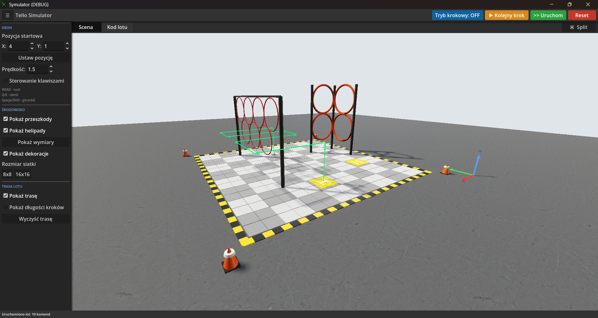
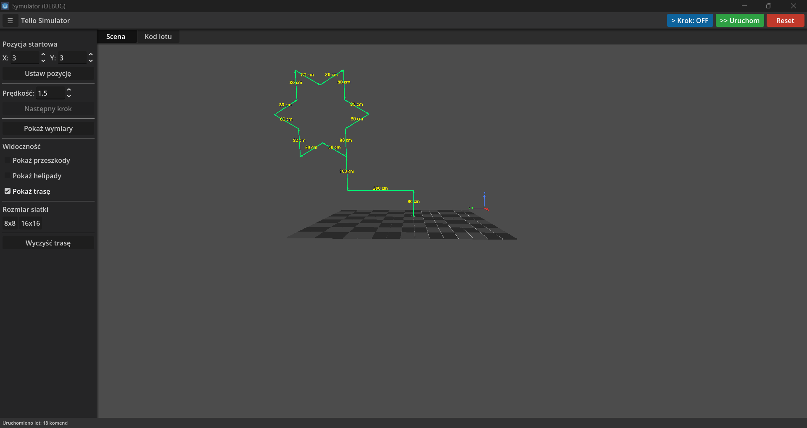

# Drone-Simulator

Drone-Simulator is a lightweight drone flight sandbox built with Godot Engine. It focuses on simple physics, a clean UI, and quick iteration for testing flight behavior in a small scene.

## Features

- Basic drone movement with responsive controls
- Simple obstacles and helipads to practice landing
- Minimal UI for status and feedback

## Run

Open [symulator/project.godot](symulator/project.godot) in Godot 4.x and run the main scene.

## Screenshots

## Video

