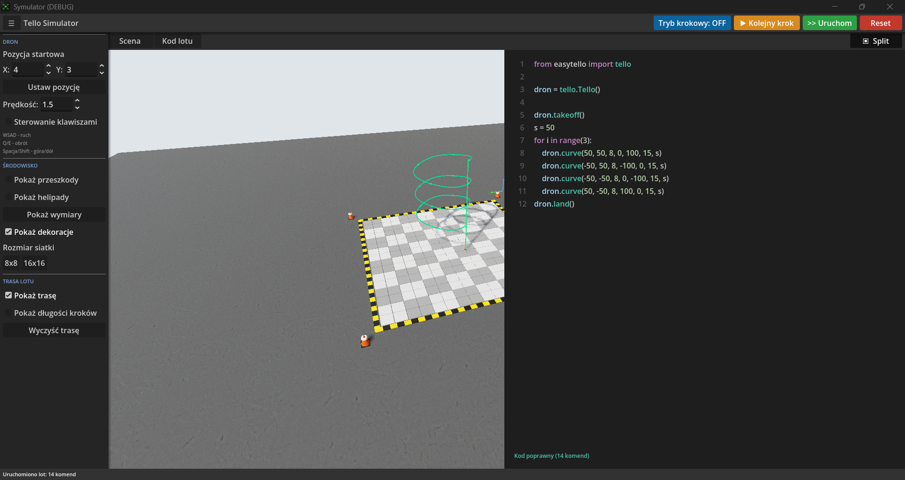
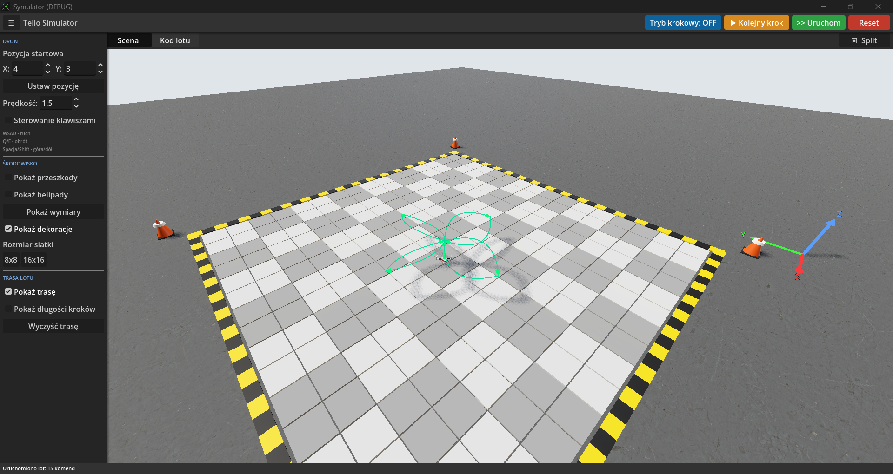
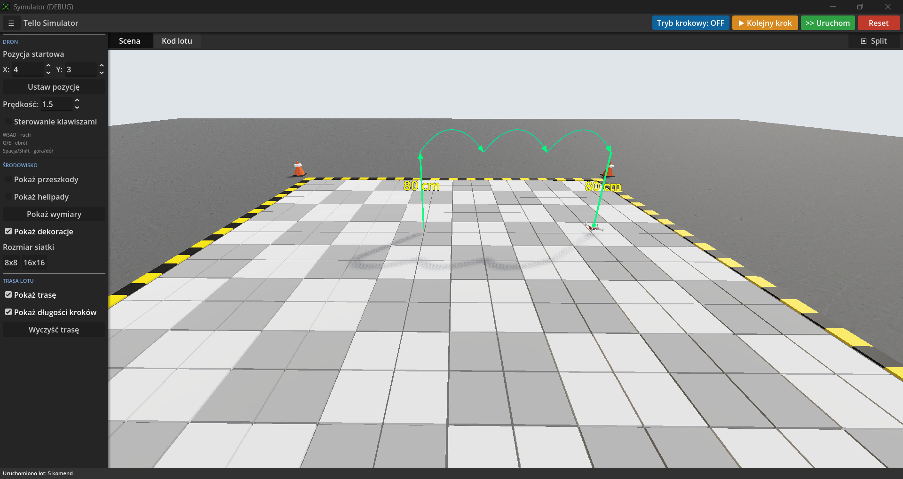

# Drone Simulator


A **DJI Tello flight simulator** built in Godot 4 that runs real `easytello`-style Python flight scripts in a 3D scene. Write the same code you would send to a physical Tello, press **Run**, and watch the drone fly the trajectory — complete with obstacle courses, collision detection, a flight trail with measured distances, and step-by-step execution for debugging.

Built as an educational tool for learning drone programming without needing real hardware.

---

## Features

| | |
|---|---|
| **Python interpreter** | Parses and executes `easytello`-style scripts — variables, `for`/`while` loops, `if/elif/else`, lists, arithmetic and the full Tello command set. |
| **Live code validation** | Code is checked as you type; syntax errors are reported and the offending line is highlighted in red. |
| **Collision detection** | The drone reacts to poles and rings; flying cleanly through a ring's opening is allowed, clipping it stops the flight. |
| **Step-by-step mode** | Execute the flight one command at a time to inspect each movement. |
| **Manual control** | Fly freely with the keyboard (WSAD / Q-E / Space-Shift). |
| **Flight trail** | Every segment is drawn with a direction arrow and its length in centimeters (toggleable). |
| **Split view** | Edit code and watch the 3D scene side by side. |
| **Configurable arena** | Toggle obstacles, helipads, decorations and dimension labels; switch the grid between 8×8 and 16×16. |
| **Studio lighting** | Three-point lighting setup with soft shadows and a textured concrete floor. |

---

## Screenshots









---

## Getting Started

1. Install [Godot Engine 4.6+](https://godotengine.org/download).
2. Clone this repository:
   ```bash
   git clone https://github.com/<your-user>/Drone-Simulator.git
   ```
3. Open [`symulator/project.godot`](symulator/project.godot) in Godot.
4. Press **F5** (or the ▶ button) to run the main scene.

---

## Building for Windows (.exe)

To export a standalone Windows executable from this project:

1. Install Godot export templates (Project → Install Export Templates) or download them from the Godot website.
2. Open the project (`symulator/project.godot`) in Godot, then go to Project → Export and add the **Windows Desktop** (or **Windows Desktop (64-bit)**) preset. Configure icon and enable "Embed PCK" if you want a single `.exe` file.
3. Click **Export Project** and choose an output path (for example `build/Drone-Simulator.exe`).

Command-line export (requires Godot on PATH):

```powershell
godot --export "Windows Desktop" "build/Drone-Simulator.exe"
```

For an optimized release build:

```powershell
godot --export-release "Windows Desktop" "build/Drone-Simulator.exe"
```

If you already have an export preset configured, you can reuse `symulator/export_presets.cfg` for the project export settings.

Notes: ensure export templates are installed and test the produced `.exe` on a Windows machine.


## Usage

### Writing a flight script

Open the **Kod lotu** (Flight Code) tab and paste an `easytello`-style script:

```python
from easytello import tello

my_drone = tello.Tello()

my_drone.takeoff()
my_drone.up(100)

my_drone.forward(120)
my_drone.right(120)     # first obstacle
my_drone.down(90)
my_drone.left(120)
my_drone.forward(140)
my_drone.land()
```

Loops and variables are supported too:

```python
for i in range(4):
    my_drone.forward(50)
    my_drone.cw(90)
```

Press **>> Uruchom** (Run) to fly. If the code has an error, the line is highlighted and the message is shown at the bottom of the editor.

### Supported commands

| Command | Arguments | Description |
|---|---|---|
| `takeoff()` | — | Lift off |
| `land()` | — | Land |
| `up(d)` / `down(d)` | cm | Vertical movement |
| `forward(d)` / `back(d)` | cm | Move along facing direction |
| `left(d)` / `right(d)` | cm | Strafe |
| `cw(deg)` / `ccw(deg)` | degrees | Rotate clockwise / counter-clockwise |
| `go(x, y, z, speed)` | cm, cm/s | Move to a relative point |
| `curve(x1, y1, z1, x2, y2, z2, speed)` | cm, cm/s | Fly a curved path through two relative points |
| `set_speed(s)` | cm/s | Set flight speed |

### Toolbar

| Button | Action |
|---|---|
| **Tryb krokowy** (Step mode) | Toggle step-by-step execution |
| **▶ Kolejny krok** (Next step) | Execute the next command |
| **>> Uruchom** (Run) | Run the full script |
| **Reset** | Reset the drone to its start position |
| **▣ Split** | Toggle the side-by-side code/scene view |

### Manual keyboard control

Enable **Sterowanie klawiszami** (Keyboard control) in the sidebar:

| Keys | Action |
|---|---|
| `W` / `S` | Forward / back |
| `A` / `D` | Left / right |
| `Q` / `E` | Rotate left / right |
| `Space` / `Shift` | Up / down |

### Camera

- **Right mouse button + drag** — orbit the camera
- **Mouse wheel** — zoom in / out

---

## Project Structure

```
symulator/
├── project.godot              # Godot project file
├── main.tscn                  # Main scene (lighting, camera, drone, UI)
├── drone.gd                   # Drone movement, command queue, collisions, step mode
├── interpreter.gd             # Python-subset parser & evaluator (PyInterpreter)
├── ui.gd                      # In-game UI: toolbar, sidebar, code editor, tabs
├── trail.gd                   # Flight trail rendering (arrows, distance labels)
├── grid.gd                    # Configurable floor grid + collision tiles
├── camera_rig.gd              # Orbit camera controller
├── environment_decor.gd       # Floor, safety tape and cones around the arena
├── helipads.gd                # Landing pads
├── dimensions.gd              # Obstacle dimension labels
├── obstacles.gd / obstacle_2.gd  # Obstacle scenes + ring collision fix-up
└── Przeszkoda1/2_Gotowa.tscn  # Pre-built obstacle scenes
```

---

## Built With

- **[Godot Engine 4.6](https://godotengine.org/)** — game engine
- **GDScript** — all gameplay and tooling logic
- A custom Python-subset interpreter (no external runtime required)

---

## License

This project is licensed under the **GNU General Public License v2.0**. See [`LICENSE`](LICENSE) for the full text.
